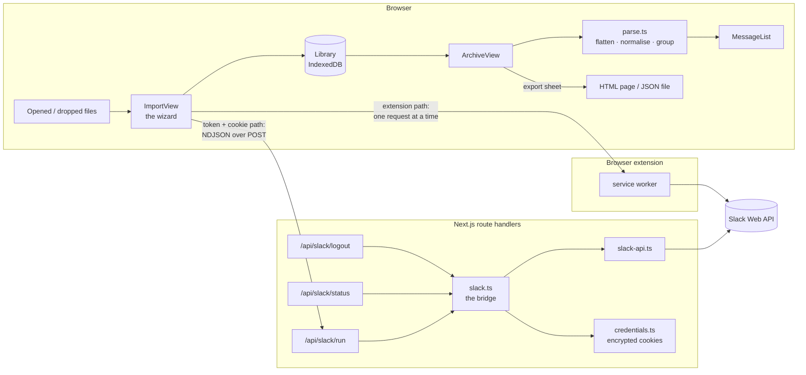
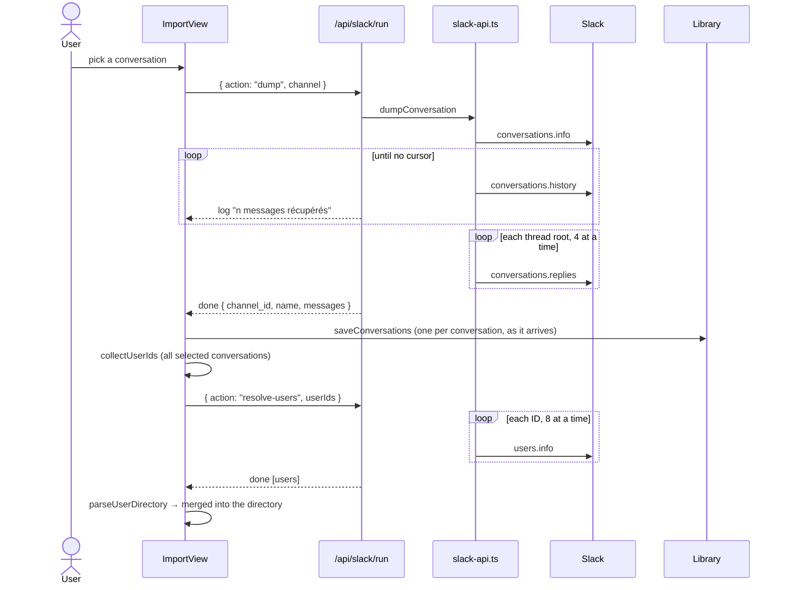

# Architecture

Loquarium (formerly Slack JSON Viewer) has two halves:

- **The app** imports Slack conversations into a local library, renders them
  faithfully, and exports them as a self-contained HTML page or as JSON. It
  runs entirely in the browser: conversations are stored in IndexedDB, and a
  file you open never leaves the browser.
- **The bridge** fetches conversations straight from Slack, so there is nothing
  to export by hand. It is a handful of Next.js route handlers calling the
  [Slack Web API](https://api.slack.com/methods). It is optional — the viewer
  works without it.

Whatever the source — the bridge or an opened file — a conversation goes
through the same `parseConversation`, lands in the same library, and is rendered
and exported by the same components.

## Repository layout

| Path | Responsibility |
| --- | --- |
| `app/page.tsx`, `app/layout.tsx` | Entry point; mounts the app; loads IBM Plex and Lato |
| `app/globals.css` | Loquarium tokens (light / dark), aliases for shadcn and the former `--slack-*` names, reading-surface rules (grouping, threads) |
| `app/api/slack/{status,run,logout}/route.ts` | The bridge's HTTP surface |
| `components/slack/viewer-client.tsx` | Mounts the app client-side only (`ssr: false`), since its initial state reads `localStorage` and IndexedDB |
| `components/app/app.tsx` | Shell (rail, header, breadcrumbs, drop overlay) and shared state: library, directory, names, preferences, bridge status, routing |
| `components/app/library-view.tsx` | Library: empty state, recently opened, archives table |
| `components/app/import-view.tsx` | Import wizard: source → Slack sign-in (live view) → conversations → progress → done; files → directory → done |
| `components/app/archive-view.tsx` | Archive: navigator, conversation, thread panel, keyboard shortcuts |
| `components/app/people-view.tsx` | People tab: who wrote, where their name comes from, inline naming |
| `components/app/export-sheet.tsx`, `exports-view.tsx` | Export side sheet and export history |
| `components/app/settings-view.tsx` | Preferences, data on this device, Slack connections |
| `components/app/ui.tsx` | Small building blocks from the design system (search field, segmented control, checkbox, switch, banners, buttons) |
| `components/slack/message-list.tsx`, `message.tsx` | Message, reactions, attachments, files, huddles, thread bar, day divider |
| `components/slack/rich-text.tsx` | `rich_text` blocks, with an `mrkdwn` fallback and search highlighting |
| `components/slack/language-switcher.tsx` | Language menu, in the header and in Settings |
| `components/ui/*` | shadcn/ui primitives |
| `lib/slack/types.ts` | Shapes of the Slack data the viewer consumes |
| `lib/slack/parse.ts` | Parsing, thread flattening, normalisation, grouping, formatting |
| `lib/slack/users.ts` | User directory parsing and ID → name resolution |
| `lib/slack/emoji.ts` | Shortcode → emoji |
| `lib/slack/bridge-types.ts` | Types shared by the bridge routes and the panel — no Node imports |
| `lib/slack/bridge-client.ts` | Browser-side client for `/api/slack/*` |
| `lib/slack/api-core.ts`, `api-text.ts` | The Slack Web API client (pagination, rate limits, threads, names), shared by the server and the extension path |
| `lib/slack/extension-client.ts`, `sources.ts` | Talking to the browser extension; `SlackSource`, what the import wizard reads from |
| `extension/` | The Loquarium browser extension (Manifest V3) |
| `lib/export/standalone.tsx` | Standalone HTML export; download helpers |
| `lib/library/store.ts`, `summary.ts` | The library in IndexedDB (in memory when unavailable); conversation summaries and titles |
| `lib/app/route.ts` | Hash routes: `#/library`, `#/import`, `#/archive/<id>/<conversation>[/people]`, `#/exports`, `#/settings` |
| `lib/app/files.ts` | Sorts opened files into conversations, directories and errors |
| `lib/app/exports-history.ts` | Export history in `localStorage` |
| `lib/i18n/` | Languages: detection, catalogues, formatting, React provider, server side |
| `lib/server/slack.ts` | The bridge: validation, sign-in, listing, dumping, resolving |
| `lib/server/slack-api.ts` | Slack Web API client: transport, pagination, rate limits, dump |
| `lib/server/credentials.ts` | Credentials in encrypted httpOnly cookies, one per workspace |

## The viewer

### Loading and the library

Files enter through `readFiles` (`lib/app/files.ts`), whether they are dropped
anywhere on the app or picked from the import wizard. For each file:

1. If it looks like JSON, `parseConversation` tries to read it as a
   conversation: either `{ channel_id, name, messages }` or a bare array of
   messages whose first entry has a string `ts`.
2. If that fails, the same text is tried as a **user directory**
   (`parseUserDirectory`): a Slack `users.json` (array or `{ members }`), or a
   column dump / TSV / CSV with an ID column (`U…`, `W…`, `B…`) and an optional
   e-mail column.
3. Anything else produces an error naming the file.

Conversations are saved with `saveConversations` into an **archive**: one per
Slack workspace (`slack:<workspace>`), plus one for local files (`files`). The
archive record holds a summary of each conversation (kind, counts, period,
participants, size, last opened); the conversation itself is stored separately
and read only when it is opened. Importing a conversation again replaces it.

Directories are **merged** into the one already known (a newer entry wins). The
directory, the manual names and the display preferences stay in `localStorage`
under the `slack-viewer:*` keys; the export history under `loquarium:exports`.

### Normalisation

`normalizeMessages` turns raw Slack messages into what the list renders
(`NormalizedMessage`):

1. **Flatten.** `flattenMessages` walks the list and every message's
   `slackdump_thread_replies` and `replies`, keeps one copy per `ts` — the one
   with the most keys, since a thread root usually carries reply metadata its
   clones lack — and sorts by `ts`.
2. **Separate roots from replies.** A message is a reply when `thread_ts` is set
   and differs from its own `ts`. Replies are bucketed under their root; a reply
   whose root is absent stays in the main flow, marked as orphaned.
3. **Normalise each message**: author (`user`, else `bot_id`), date, day key,
   plain text, and a lower-cased `searchText` that also covers blocks,
   attachments and file names. A root's `searchText` includes its replies', so
   searching finds a thread by any of its messages.
4. **Group.** A message is `grouped` with the previous one when the author, the
   day and a five-minute window all match. Grouping is broken after a thread
   root, so its reply bar is never left above a headerless message.

`buildMeta` derives the header: kind (`channel`, `dm`, `group-dm`),
participants, message count and date range. A DM or group DM without a name gets
a title rebuilt from its participants, or from the `mpdm-…` handle.

### Rendering

Every message is rendered **with** its full header and its compact timestamp,
plus a `data-grouped` attribute. CSS in `globals.css` decides what shows: a
grouped message hides its avatar and header, and a `.slack-filtering` ancestor
— applied while searching or filtering by author — shows them again. Filtering
therefore never re-renders the list.

A thread root also renders its replies, hidden, inside
`[data-thread-replies]`. The app's thread panel renders from state; the exported
page clones that hidden node into its own panel.

### Names

`resolveUser` looks an ID up in the directory, then in the manual overrides,
then among built-ins (`USLACKBOT`); unknown IDs render as the raw ID with an
*unresolved* badge and a deterministic avatar colour. The banner above the list
counts unknown IDs and opens the **People** tab, where they can be named inline,
with suggestions taken from an `mpdm-…` channel name.

### Export

The header's **Export** button opens a side sheet with two formats (PDF and
the evidence pack are shown as coming soon). Every export is recorded in the
Exports screen.

**HTML page** (`buildStandaloneHtml`). The same `MessageList` component is
rendered with `renderToStaticMarkup`, every same-origin stylesheet of the live
document is inlined, and a small vanilla script is appended. The result is a
single file with no network dependency that looks exactly like the app and keeps
search with highlighting, the author filter, the thread panel, a light/dark
toggle and a print layout.

**JSON** (`downloadJson`). The loaded conversation, indented. It reloads into
the viewer as is. The user directory is not included: it lives in
`localStorage`.

### Navigation

Screens live in the URL hash (`lib/app/route.ts`), so the browser's back and
forward buttons move between them and a reload stays put. The header's back
arrow goes to the previous breadcrumb. In an archive, `⌘K` focuses the
conversation filter, `⌘F` the search, and `Esc` closes the thread panel.

The import wizard keeps its steps in its own state: going back to a step keeps
the channel list and the selection.

## Languages

The interface speaks French, English, Spanish, Chinese (simplified) and
Russian. Everything is translated: the viewer, the connection panel, the
bridge's progress lines and errors, and the exported page.

### Picking the language

`I18nProvider` (`lib/i18n/react.tsx`) wraps the viewer. The language is the one
chosen by hand in the language menu, stored under `slack-viewer:locale`, or
else the first of `navigator.languages` the app supports — matched on the
primary subtag, so `fr-CA` gives French and `zh-TW` Chinese. **A browser in any
other language gets English.** The menu's *Browser language* entry removes the
stored choice. The provider also sets `<html lang>`.

### Catalogues

One file per language in `lib/i18n/messages/`. `fr.ts` is the reference: its
shape is the `Messages` type, and every other catalogue is declared as
`Messages`, so a missing or extra key fails the build. Messages are plain data:

- strings with `{name}` placeholders, filled by `t(template, params)`;
- plurals, keyed by CLDR category (`one`, `few`, `many`, `other`…) and picked
  with `Intl.PluralRules` by `p(forms, n, params)` — Russian uses four forms,
  Chinese one.

Components read `const { m, t, p, fmt } = useI18n()` and write
`p(m.thread.replies, n)`. Dates, numbers and file sizes go through `fmt`
(`lib/i18n/format.ts`), which wraps `Intl` for the active language; *today* and
*yesterday* come from `Intl.RelativeTimeFormat`, so they need no translation.

Errors that are stored before being shown — a file that failed to load — are
kept as functions of the catalogue, so they follow a language change instead
of staying in the language they were raised in. Parse errors carry a code
(`SlackParseError.code`) for the same reason.

### The bridge

The browser sends its language in an `x-slack-viewer-locale` header on every
`/api/slack/*` request (`bridge-client.ts`), falling back to `Accept-Language`
when absent. Each route runs its work inside `withLocale`
(`lib/i18n/server.ts`), an `AsyncLocalStorage`, so code anywhere below reads
its wording with `sm()` without the language being passed around. On the
extension path the same `server` catalogue words the progress lines, in the
page (`lib/slack/api-text.ts`).

### The exported page

The page is written in the language on screen when exporting: the markup is
rendered inside `StaticI18nProvider`, `<html lang>` is set, and the few strings
the page's script composes itself — the message counter and the thread
panel's reply count — are serialised into `window.SLACK_EXPORT_I18N` with
their plural forms and language tag.

## The browser extension

`extension/` is a Manifest V3 extension that lets the page read Slack **with
the session already open in the browser** — the recommended way in, since it
asks the person for nothing.

- The page talks to it with `chrome.runtime.sendMessage(EXTENSION_ID, …)`
  (`lib/slack/extension-client.ts`); only origins listed in the manifest's
  `externally_connectable` can.
- `teams` reads the signed-in workspaces from `localStorage["localConfig_v2"]`
  in an app.slack.com tab (opening one in the background if needed) and
  returns their names and domains — never their tokens.
- `call` makes **one** read-only API request (seven allowed methods) with the
  stored client token and the browser's `d` cookie, and returns Slack's answer.

Everything else runs in the page: `lib/slack/api-core.ts` is the same client the
server uses, with the transport and the wording injected
(`lib/slack/sources.ts` → `extensionSource`). No request goes through
Loquarium's server on this path. See `extension/README.md`.

The import wizard only sees a `SlackSource` (`channels`, `dump`, `users`): the
bridge and the extension are interchangeable behind it.

## The bridge

### HTTP surface

| Route | Method | Purpose |
| --- | --- | --- |
| `/api/slack/status` | `GET` | Whether the bridge is available, and which workspaces this browser has signed in to (from its cookies). |
| `/api/slack/run` | `POST` | Runs one operation and streams its progress. |
| `/api/slack/logout` | `POST` | Clears the credential cookie for a workspace. |

All three run on the Node.js runtime and are never cached. `run` declares
`maxDuration = 300`, the most every Vercel plan allows.

### The `run` protocol

The request body is a `RunRequest` (`lib/slack/bridge-types.ts`):

| `action` | Fields | Result |
| --- | --- | --- |
| `auth-token` | `workspace`, `token`, `cookie` | `{ workspace }` |
| `channels` | `workspace`, `memberOnly?` (default `true`) | `ChannelSummary[]` |
| `dump` | `workspace`, `channel` | `{ channel_id, name, messages }` |
| `resolve-users` | `workspace`, `userIds` | Slack user objects |

The response is NDJSON: one `RunEvent` per line — any number of
`{ "t": "log", "m": … }`, then exactly one `{ "t": "done", "data": … }` or
`{ "t": "error", "m": …, "detail"?: … }`. `runJob` in `bridge-client.ts` reads
the stream, forwards each log line to the panel as it arrives, and resolves or
rejects on the final event. Cancelling aborts the fetch; the route passes
`request.signal` down, so the Slack requests stop too. `auth-token` is the
exception: it sets a cookie, and headers go before the body, so it runs to the
end (one `auth.test`) and answers in one piece.

Workspace names are normalised (`acme.slack.com`, `https://acme.slack.com/` →
`acme`) and checked against `^[a-z0-9][a-z0-9._-]*$`; channel IDs against
`^[A-Z][A-Z0-9]{2,}$`.

### Signing in

The caller pastes a client token (`xoxc-…`) and the `d` cookie (`xoxd-…`) read
from their own browser; a `xoxc`/`xoxe` token is refused without its cookie.
The pair is checked with `auth.test` — a bad paste fails at once, with the
Slack user and team named on success — then stored in a cookie (see
[Credentials](#credentials)).

### Fetching

All calls go through `call()` in `lib/slack/api-core.ts`, shared with the
extension path; the server's transport (`lib/server/slack-api.ts`) sends a form-encoded `POST` carrying
the token both as `Authorization: Bearer` and as a `token` field, as Slack's own
web client does, and the `d` cookie **exactly as Slack set it** — it is already
URL-encoded, and encoding it again breaks authentication.

| Need | Method | Notes |
| --- | --- | --- |
| Validate credentials | `auth.test` | |
| The caller's conversations | `users.conversations` | Default listing |
| Every visible conversation | `conversations.list` | Only when *member only* is unticked |
| Channel name | `conversations.info` | Empty for DMs |
| Messages | `conversations.history` | Roots only, newest first |
| Thread replies | `conversations.replies` | One call per thread root |
| Participants' names | `users.info` | One call per ID found in the dump |

- **Pagination** follows `response_metadata.next_cursor`, capped at 30 pages for
  listings and 500 pages of 200 for history (100 000 messages).
- **Rate limits.** An HTTP `429` is retried after the `Retry-After` delay Slack
  gives, at most three times and never waiting more than 60 s; a `ratelimited`
  error in the JSON body backs off linearly.
- **Concurrency.** Thread replies are fetched four at a time
  (`conversations.replies` is Tier 3), user lookups eight at a time
  (`users.info` is Tier 4).
- **Per-item tolerance.** `users.info` skips `user_not_found` and
  `account_inactive`; `conversations.replies` skips `thread_not_found`. One bad
  item never fails the batch.
- **Credential errors** (`invalid_auth`, `not_authed`, `token_revoked`,
  `token_expired`) surface as a plain message asking to sign in again.

`dumpConversation` fetches the history, sorts it oldest first, then fetches the
replies of every root with `reply_count > 0` and stores them — root included, as
Slack returns them — in the root's `replies`. The viewer's flattening removes
the duplicate. **A dump with no messages is an error, not an empty
conversation:** the panel says Slack returned nothing, instead of loading a blank
page. On Enterprise Grid a token is tied to one workspace, so a conversation
listed by `users.conversations` is not always one `conversations.history` will
serve.

### Opening a conversation, end to end

`collectUserIds` scans the dump for quoted IDs — authors, reaction voters,
`reply_users`, `user_id` in rich-text blocks, `bot_id` — and for `<@U…>` /
`<@U…|label>` mentions, which only appear inside message text. Several
conversations are imported one after another; the people of all of them are
resolved in a single pass at the end. A conversation that fails pauses the
import with *Retry* / *Skip*; cancelling keeps what was already saved.

## Credentials

A deployment is shared, and a Slack client token reads a whole workspace, so
the server stores nothing at all: each browser carries its own credentials.

- **One cookie per workspace**, `lq_ws_<workspace>`: `HttpOnly`,
  `SameSite=Strict`, `Path=/api/slack`, `Secure` over HTTPS or behind a proxy
  that says so, `Max-Age` = `SLACK_VIEWER_SESSION_TTL_HOURS` (12 by default).
- **Content.** `{ token, cookie }` in AES-256-GCM, laid out as
  `iv (12 bytes) | tag (16 bytes) | ciphertext`, base64url. The key is
  `sha256("loquarium-credentials:" + SLACK_VIEWER_SECRET)`. A value that does not
  decrypt — tampered, or sealed under another secret — reads as "not signed in".
- **Without `SLACK_VIEWER_SECRET`** a random key is made per server instance:
  nothing leaks, but a restart (or another serverless instance) signs everyone
  out. Set it in production.
- **Listing.** *Connected workspaces* is the set of `lq_ws_*` cookies that
  decrypt. Logging out expires the cookie.

Being stateless is what lets the whole app run on Vercel. The recommended
path, the browser extension, does not involve the server at all.

## Limits

- One conversation at a time: the viewer holds a single conversation.
- Attached files and images are shown as cards linking to Slack: fetching
  `url_private` needs an authenticated request, which the dump does not make.
- No date range: `conversations.history` would accept `oldest` / `latest`, but
  the panel does not expose them.
- The JSON export carries the conversation only; names resolved into the
  directory stay in the browser that resolved them.
