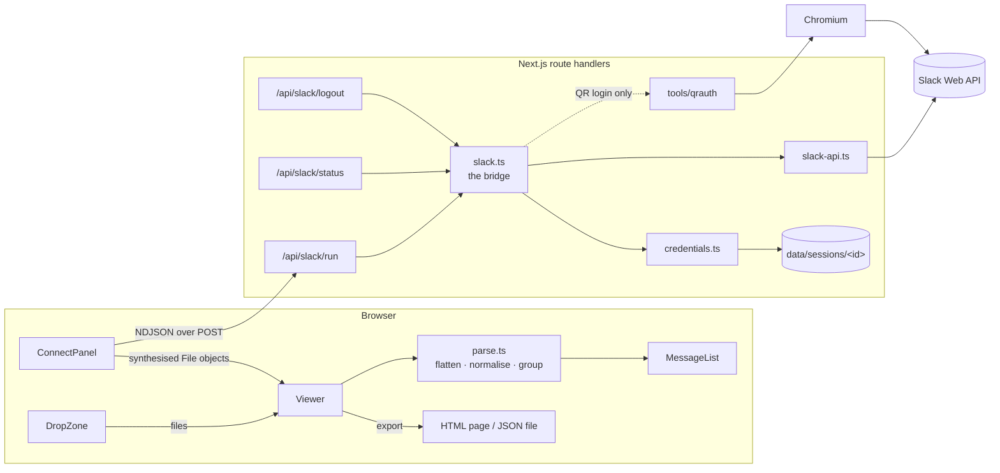
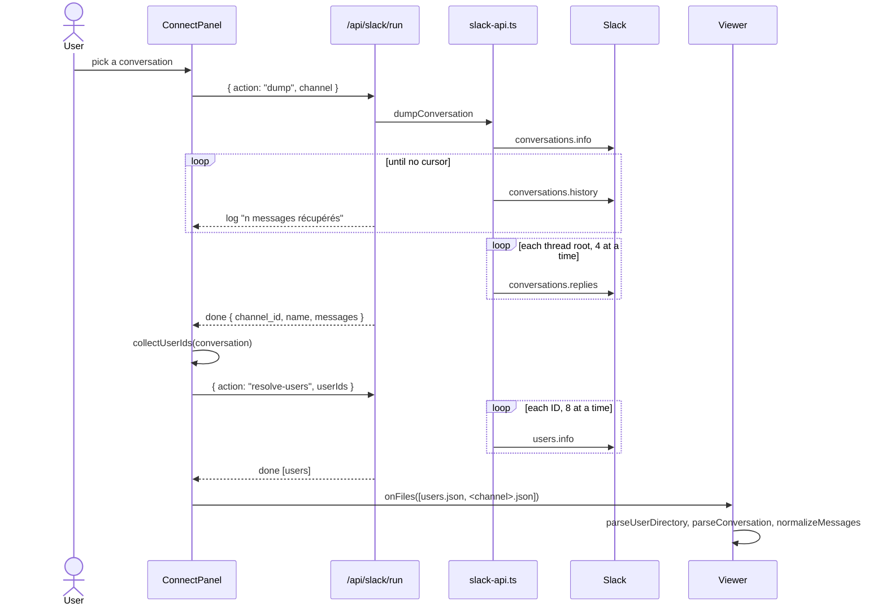

# Architecture

Slack JSON Viewer has two halves that share one screen:

- **The viewer** reads a Slack conversation and renders it in Slack's own look,
  then exports it as a self-contained HTML page or as JSON. It runs entirely in
  the browser: a file you drop never leaves it.
- **The bridge** fetches conversations straight from Slack, so there is nothing
  to export by hand. It is a handful of Next.js route handlers calling the
  [Slack Web API](https://api.slack.com/methods). It is optional — the viewer
  works without it.

The bridge hands its results to the viewer as if they were dropped files, so
everything downstream of loading — parsing, rendering, export — has exactly one
code path.

## Repository layout

| Path | Responsibility |
| --- | --- |
| `app/page.tsx`, `app/layout.tsx` | Entry point; mounts the viewer |
| `app/globals.css` | Slack design tokens, light and dark palettes, grouping rules |
| `app/api/slack/{status,run,logout}/route.ts` | The bridge's HTTP surface |
| `components/slack/viewer-client.tsx` | Mounts the viewer client-side only (`ssr: false`), since its initial state reads `localStorage` |
| `components/slack/viewer.tsx` | Global state: conversation, directory, search, author filter, theme, thread panel, export, and the connection panel |
| `components/slack/drop-zone.tsx` | Home screen: drag and drop, file picker, directory picker, *Connecter* entry point |
| `components/slack/connect-panel.tsx` | Sign in → pick a conversation → fetch, with live progress |
| `components/slack/message-list.tsx`, `message.tsx` | Message, reactions, attachments, files, huddles, thread bar, day divider |
| `components/slack/rich-text.tsx` | `rich_text` blocks, with an `mrkdwn` fallback and search highlighting |
| `components/slack/sidebar.tsx` | Aubergine sidebar; the member list doubles as the author filter |
| `components/ui/*` | shadcn/ui primitives |
| `lib/slack/types.ts` | Shapes of the Slack data the viewer consumes |
| `lib/slack/parse.ts` | Parsing, thread flattening, normalisation, grouping, formatting |
| `lib/slack/users.ts` | User directory parsing and ID → name resolution |
| `lib/slack/emoji.ts` | Shortcode → emoji |
| `lib/slack/bridge-types.ts` | Types shared by the bridge routes and the panel — no Node imports |
| `lib/slack/bridge-client.ts` | Browser-side client for `/api/slack/*` |
| `lib/export/standalone.tsx` | Standalone HTML export; download helpers |
| `lib/server/slack.ts` | The bridge: validation, sign-in, listing, dumping, resolving |
| `lib/server/slack-api.ts` | Slack Web API client: transport, pagination, rate limits, dump |
| `lib/server/credentials.ts` | Per-session encrypted credential storage |
| `lib/server/session.ts` | Session cookie, per-session directory, key derivation, expiry |
| `tools/qrauth/` | Go helper for the QR sign-in (separate Go module) |
| `docker/`, `Dockerfile`, `docker-compose.yml` | Container image for the QR sign-in |

## The viewer

### Loading

Everything enters through `handleFiles` in `viewer.tsx`, whether the files come
from a drop, the file picker, or the bridge. For each file:

1. If it looks like JSON, `parseConversation` tries to read it as a
   conversation: either `{ channel_id, name, messages }` or a bare array of
   messages whose first entry has a string `ts`.
2. If that fails, the same text is tried as a **user directory**
   (`parseUserDirectory`): a Slack `users.json` (array or `{ members }`), or a
   column dump / TSV / CSV with an ID column (`U…`, `W…`, `B…`) and an optional
   e-mail column.
3. Anything else produces an error naming the file.

The directory, its file name, the manual name overrides and the display
preferences are persisted in `localStorage` under the `slack-viewer:*` keys.
The conversation itself is not persisted.

### Normalisation

`normalizeMessages` turns raw Slack messages into what the list renders
(`NormalizedMessage`):

1. **Flatten.** `flattenMessages` walks the list and every message's
   `slackdump_thread_replies` and `replies`, keeps one copy per `ts` — the one
   with the most keys, since a thread root usually carries reply metadata its
   clones lack — and sorts by `ts`.
2. **Separate roots from replies.** A message is a reply when `thread_ts` is set
   and differs from its own `ts`. Replies are bucketed under their root; a reply
   whose root is absent stays in the main flow, marked as orphaned.
3. **Normalise each message**: author (`user`, else `bot_id`), date, day key,
   plain text, and a lower-cased `searchText` that also covers blocks,
   attachments and file names. A root's `searchText` includes its replies', so
   searching finds a thread by any of its messages.
4. **Group.** A message is `grouped` with the previous one when the author, the
   day and a five-minute window all match. Grouping is broken after a thread
   root, so its reply bar is never left above a headerless message.

`buildMeta` derives the header: kind (`channel`, `dm`, `group-dm`),
participants, message count and date range. A DM or group DM without a name gets
a title rebuilt from its participants, or from the `mpdm-…` handle.

### Rendering

Every message is rendered **with** its full header and its compact timestamp,
plus a `data-grouped` attribute. CSS in `globals.css` decides what shows: a
grouped message hides its avatar and header, and a `.slack-filtering` ancestor
— applied while searching or filtering by author — shows them again. Filtering
therefore never re-renders the list.

A thread root also renders its replies, hidden, inside
`[data-thread-replies]`. The app's thread panel renders from state; the exported
page clones that hidden node into its own panel.

### Names

`resolveUser` looks an ID up in the directory, then in the manual overrides,
then among built-ins (`USLACKBOT`); unknown IDs render as the raw ID with an
*unresolved* badge and a deterministic avatar colour. The banner above the list
counts unknown IDs and opens a dialog to name them, pre-filled with suggestions
taken from an `mpdm-…` channel name.

### Export

The header's **Exporter** menu offers two formats.

**HTML page** (`buildStandaloneHtml`). The same `MessageList` component is
rendered with `renderToStaticMarkup`, every same-origin stylesheet of the live
document is inlined, and a small vanilla script is appended. The result is a
single file with no network dependency that looks exactly like the app and keeps
search with highlighting, the author filter, the thread panel, a light/dark
toggle and a print layout.

**JSON** (`downloadJson`). The loaded conversation, indented. It reloads into
the viewer as is. The user directory is not included: it lives in
`localStorage`.

### Navigation

The back arrow at the left of the header goes back where the conversation came
from: to the channel list when the bridge is available, and to the home screen
otherwise. The browser's own back button does the same: while a conversation is
on screen, one history entry is pushed, and popping it runs the same code; the
arrow pops that entry too, so the two never disagree.

Landing back on the list, rather than on the sign-in step, relies on the panel
never remounting. `viewer.tsx` renders `ConnectPanel` **first, in both
branches** — home screen and conversation — so React keeps the same instance,
with its step, its channels and its filter. Rendering it at a different place in
each branch silently resets it. Because the dialog now reopens without
remounting, its content sits one z-index above its overlay
(`components/ui/dialog.tsx`): Radix portals the two separately, and the overlay
can otherwise end up covering the content.

## The bridge

### HTTP surface

| Route | Method | Purpose |
| --- | --- | --- |
| `/api/slack/status` | `GET` | What the bridge can do (`available`, QR helper availability) and which workspaces the caller has signed in to. Mints the session cookie on first contact. |
| `/api/slack/run` | `POST` | Runs one operation and streams its progress. |
| `/api/slack/logout` | `POST` | Forgets the caller's credentials for a workspace. |

All three run on the Node.js runtime and are never cached.

### The `run` protocol

The request body is a `RunRequest` (`lib/slack/bridge-types.ts`):

| `action` | Fields | Result |
| --- | --- | --- |
| `auth-token` | `workspace`, `token`, `cookie` | `{ workspace }` |
| `auth-qr` | `workspace`, `qrImage` (a `data:image/…` URL) | `{ workspace }` |
| `channels` | `workspace`, `memberOnly?` (default `true`) | `ChannelSummary[]` |
| `dump` | `workspace`, `channel` | `{ channel_id, name, messages }` |
| `resolve-users` | `workspace`, `userIds` | Slack user objects |

The response is NDJSON: one `RunEvent` per line — any number of
`{ "t": "log", "m": … }`, then exactly one `{ "t": "done", "data": … }` or
`{ "t": "error", "m": …, "detail"?: … }`. `runJob` in `bridge-client.ts` reads
the stream, forwards each log line to the panel as it arrives, and resolves or
rejects on the final event. Cancelling aborts the fetch; the route passes
`request.signal` down, so the Slack requests — or the QR helper process — stop
too.

Workspace names are normalised (`acme.slack.com`, `https://acme.slack.com/` →
`acme`) and checked against `^[a-z0-9][a-z0-9._-]*$`; channel IDs against
`^[A-Z][A-Z0-9]{2,}$`.

### Signing in

Both paths end in `registerWorkspace`: the credentials are checked with
`auth.test` — a bad paste fails at once, with the Slack user and team named on
success — then stored for the session.

- **Token and cookie.** The caller pastes a client token (`xoxc-…`) and the `d`
  cookie (`xoxd-…`) read from their own browser. A `xoxc`/`xoxe` token is
  refused without its cookie.
- **QR code.** The caller pastes the image of Slack's *Sign in on mobile* QR
  code. The bridge runs `tools/qrauth`, which returns a token and a `d` cookie
  (see [The QR helper](#the-qr-helper)). This path is offered only where the
  helper exists or can be built; elsewhere the panel shows the token path alone.

### Fetching

All calls go through `call()` in `slack-api.ts`: a form-encoded `POST` carrying
the token both as `Authorization: Bearer` and as a `token` field, as Slack's own
web client does, and the `d` cookie **exactly as Slack set it** — it is already
URL-encoded, and encoding it again breaks authentication.

| Need | Method | Notes |
| --- | --- | --- |
| Validate credentials | `auth.test` | |
| The caller's conversations | `users.conversations` | Default listing |
| Every visible conversation | `conversations.list` | Only when *member only* is unticked |
| Channel name | `conversations.info` | Empty for DMs |
| Messages | `conversations.history` | Roots only, newest first |
| Thread replies | `conversations.replies` | One call per thread root |
| Participants' names | `users.info` | One call per ID found in the dump |

- **Pagination** follows `response_metadata.next_cursor`, capped at 30 pages for
  listings and 500 pages of 200 for history (100 000 messages).
- **Rate limits.** An HTTP `429` is retried after the `Retry-After` delay Slack
  gives, at most three times and never waiting more than 60 s; a `ratelimited`
  error in the JSON body backs off linearly.
- **Concurrency.** Thread replies are fetched four at a time
  (`conversations.replies` is Tier 3), user lookups eight at a time
  (`users.info` is Tier 4).
- **Per-item tolerance.** `users.info` skips `user_not_found` and
  `account_inactive`; `conversations.replies` skips `thread_not_found`. One bad
  item never fails the batch.
- **Credential errors** (`invalid_auth`, `not_authed`, `token_revoked`,
  `token_expired`) surface as a plain message asking to sign in again.

`dumpConversation` fetches the history, sorts it oldest first, then fetches the
replies of every root with `reply_count > 0` and stores them — root included, as
Slack returns them — in the root's `replies`. The viewer's flattening removes
the duplicate. **A dump with no messages is an error, not an empty
conversation:** the panel says Slack returned nothing, instead of loading a blank
page. On Enterprise Grid a token is tied to one workspace, so a conversation
listed by `users.conversations` is not always one `conversations.history` will
serve.

### Opening a conversation, end to end

`collectUserIds` scans the dump for quoted IDs — authors, reaction voters,
`reply_users`, `user_id` in rich-text blocks, `bot_id` — and for `<@U…>` /
`<@U…|label>` mentions, which only appear inside message text. The directory
file is handed over first, so the conversation renders with names on the first
paint.

## Sessions and credentials

A deployment is shared, and a Slack client token reads a whole workspace, so
nothing the bridge stores is global.

- **Session.** On first contact the server mints a 32-byte random ID, sent as
  the `slack-viewer-session` cookie (`HttpOnly`, `SameSite=Lax`, `Secure` over
  HTTPS or behind a proxy that says so). An incoming value is used only if it
  matches `^[A-Za-z0-9_-]{32,64}$`, since it becomes a directory name.
- **Storage.** Each session owns `<data>/sessions/<id>/`. Credentials for a
  workspace live in `<workspace>.api`: AES-256-GCM, laid out as
  `iv (12 bytes) | tag (16 bytes) | ciphertext`.
- **Key.** `sha256(HMAC-SHA256(sha256(SLACK_VIEWER_SECRET), sessionId))`. A
  file is therefore unreadable without its session cookie, even with the whole
  volume in hand. Without `SLACK_VIEWER_SECRET`, a random secret is generated at
  boot: nothing leaks, but a restart signs everyone out.
- **Listing.** The *Déjà connecté* list is the set of `*.api` files in the
  session directory. Logging out deletes the file.
- **Expiry.** Each use refreshes the directory's modification time. The status
  route sweeps — at most every ten minutes — directories idle for longer than
  `SLACK_VIEWER_SESSION_TTL_HOURS` (12 by default). A visitor who never signs in
  gets no directory at all.

## The QR helper

`tools/qrauth` is a small Go program, and the only part of the bridge that is
not a Web API call: consuming a *Sign in on mobile* link needs a real browser.

1. Decode the pasted `data:` URL, then the QR code in it (`readqr`), into a
   one-shot sign-in link. Its host and path are logged; the query string, which
   is the credential, never is.
2. Check that `https://<workspace>.slack.com` is reachable, so a network problem
   fails fast instead of timing out.
3. Launch Chromium through [rod](https://github.com/go-rod/rod), open the link,
   and poll the browser's cookies every 500 ms until a `d=xoxd-…` cookie
   appears. Slack's *open in the app* interstitial is dismissed if it shows, but
   nothing waits on it. The page the browser is on is logged every five
   seconds.
4. Close the browser and read the client token from `/ssb/redirect` with that
   cookie, over plain HTTP.
5. Print `{ token, cookie, workspace }` on stdout. On failure, log the last page
   reached and write a screenshot of it.

`slack.ts` runs the helper with the QR data on stdin — never in `argv` — at most
`SLACK_VIEWER_MAX_LOGINS` (2) at a time, each login costing a Chromium.

The browser runs headful by default (`QRAUTH_HEADLESS=1` switches it), so the
container image runs a virtual display: `docker/entrypoint.sh` starts one
`Xvfb` for the container's lifetime and waits for its socket before starting the
server. `docker/chromium-wrapper.sh`, pointed to by `CHROME_BIN`, adds the flags
a container needs (`--no-sandbox`, `--disable-dev-shm-usage`, …), which the
helper cannot pass itself.

This path has not yet signed in successfully on the workspace it was built for:
the link opens, but no `d` cookie ever appears. The token path works there, so
it is not blocking.

## Limits

- One conversation at a time: the viewer holds a single conversation.
- Attached files and images are shown as cards linking to Slack: fetching
  `url_private` needs an authenticated request, which the dump does not make.
- No date range: `conversations.history` would accept `oldest` / `latest`, but
  the panel does not expose them.
- The JSON export carries the conversation only; names resolved into the
  directory stay in the browser that resolved them.
