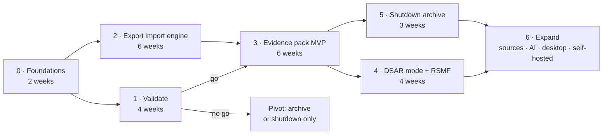

# Roadmap

How to get from today's viewer to the product in [strategy.md](strategy.md),
with a validation step before each large investment. Durations assume one
developer working part-time; the order matters more than the dates.

---

## Phase 0 — Foundations (≈ 2 weeks)

Make the project sellable before selling it.

- [ ] **Name and brand** without "Slack" in them ("… for Slack" is acceptable
      in store listings). Check domain and trademark availability.
- [ ] **Remove company-specific references** from the code and comments
      (`connect-panel.tsx`, `lib/server/slack.ts`, `lib/server/slack-api.ts`).
- [ ] **Choose the open-core licence** (MIT or AGPL) and split the repository
      layout: `core/` (viewer, open) and `pro/` (paid modules) — or a separate
      private package.
- [ ] **Legal checklist**: intellectual property of the code, legal structure
      able to invoice, merchant of record.
- [ ] **Landing page** with a waitlist, one variant per segment (legal & HR,
      shutdown archive, free-plan archive). Privacy-friendly analytics.
- [ ] Move the live Slack bridge behind a build flag: **off** in the hosted
      product, **on** for personal and self-hosted builds.

**Exit:** a public page, a name, a clean repository.

---

## Phase 1 — Validate (≈ 4 weeks, alongside phase 2)

Check that legal and HR buyers pay before building their product.

- [ ] **15 interviews**: 6 employment lawyers, 4 HR or DPOs, 3 eDiscovery or
      forensic consultants, 2 commissaires de justice. Questions: last time you
      needed Slack or WhatsApp messages as evidence — what did you do, how
      long did it take, what did it cost, what went wrong?
- [ ] **Concierge packs**: produce 3–5 evidence packs by hand, with the current
      viewer and a script, for real cases. Charge if at all possible.
- [ ] **Show a mock pack** (PDF + HTML + manifest) and ask what is missing for
      them to use it in a file.
- [ ] Measure landing-page sign-ups per segment.

**Go** if at least two of: 3 paid concierge packs or signed letters of intent;
≥ 40 % of the legal interviewees ready to pay ≥ €79 per pack; the legal variant
converts at least twice as well as the others.

**No go** → fall back to the shutdown archive (idea F) and the free-plan archive
(idea C), which need phase 2 but not phases 3–4.

---

## Phase 2 — Export import engine (≈ 6 weeks)

The prerequisite for every paid direction: read Slack's **official export ZIP**,
not just one conversation.

| Work | Where | Notes |
| --- | --- | --- |
| ZIP reader in a web worker | `lib/import/slack-export.ts` (new) | Streams entries; never holds the whole ZIP as one string |
| Export model | `lib/import/model.ts` (new) | Channels, private channels, DMs, group DMs, users, day files → one message store. The seam for future sources (WhatsApp, Teams) |
| Local storage | IndexedDB or OPFS | Reopen a large export without re-importing it |
| Channel browser | `components/slack/sidebar.tsx` | Today the sidebar shows one conversation |
| Virtualised message list | `components/slack/message-list.tsx` | Channels with 100 000+ messages |
| Search index in a worker | new | Across the whole export; the existing per-conversation search stays |
| Filters | new | Date range, people, channels — the selection every paid feature builds on |
| Explicit time zone | `lib/i18n/format.ts` | Shown and chosen, not implied by the browser |
| Fixtures and tests | `tests/fixtures/` (new) | Real-shape exports for Free, Pro, Business+, Grid; anonymised |

Keep today's single-file loading working: it is the simplest entry point.

**Exit:** a 1 GB export opens, is searchable, and stays under a few seconds per
action on an ordinary laptop. Free tier launched publicly.

---

## Phase 3 — Evidence pack MVP (≈ 6 weeks)

| Work | Notes |
| --- | --- |
| **Selection → pack** flow | From the filters of phase 2 |
| **PDF** | Paged layout, page numbers, optional Bates prefix; threads inline; edits marked; time zone in the header |
| **HTML** | The existing standalone export, extended to multi-channel selections (`lib/export/standalone.tsx`) |
| **Source JSON** | The included messages, untouched |
| **Integrity manifest** | SHA-256 (WebCrypto) of the source ZIP and every output; tool version; filters; time zone; processing time |
| **Deterministic output** | Same input + same selection = same bytes; tested |
| **Redaction v1** | Automatic detection (e-mails, phone numbers, names from the directory) plus manual selection; redaction applied to all outputs and listed in the manifest |
| **Licensing** | Licence keys from the merchant of record, checked online and cached; paid features unlocked in the browser |
| **Guides** | "Produce Slack messages as evidence", in French and English |

**Exit:** first paying customers; a pack produced in under 10 minutes from an
export the user has never opened before.

---

## Phase 4 — DSAR mode and RSMF (≈ 4 weeks)

- [ ] **DSAR mode**: pick a person → every message by, to, or mentioning them
      (IDs and `<@…>` mentions — `collectUserIds` already knows where IDs hide)
      → review → third-party redaction → pack with a cover index. Deadline
      reminder.
- [ ] **RSMF export** for review platforms.
- [ ] **Firm plan**: saved matters (selections and settings, stored locally or
      in an encrypted file), processing log.

---

## Phase 5 — Workspace shutdown archive (≈ 3 weeks)

- [ ] **Offline site** from a full export: one HTML page per channel, a
      prebuilt search index, a home page — a folder for a shared drive, no
      server.
- [ ] One-off purchase per workspace.
- [ ] Optional: conversion to the destination's import format (Mattermost bulk
      import first).

Can run in parallel with phase 4.

---

## Phase 6 — Expand (once the beachhead pays)

Ordered by expected value:

1. **WhatsApp import** — the most common chat evidence after e-mail. Same
   buyers, same packs.
2. **Microsoft Teams and Discord imports.**
3. **AI add-on** — thread summaries, decision log, relevance tagging for
   reviewers. Opt-in, bring-your-own-key or local model, no training.
4. **Desktop app** (Tauri) — for firms whose policy forbids web tools on case
   data.
5. **Hosted share links** — password, expiry, access log (idea E).
6. **Self-hosted enterprise edition** — the live Slack bridge, connected
   through the customer's own Slack app — **only after** the legal question in
   [strategy.md](strategy.md) §10 is answered.
7. **Free-plan archive** (idea C) and **public community archive** (idea D) on
   the same import engine.

---

## Metrics

| Stage | Metric | First target |
| --- | --- | --- |
| Acquisition | Visitors to the free viewer; exports opened | 1 000 exports opened a month |
| Activation | Export opened → filter or search used | 50 % |
| Conversion | Free users who buy a pack or plan | 2–3 % |
| Value | Time from export to finished pack | < 10 minutes |
| Revenue | MRR, and one-off pack revenue | €2 000 MRR in 6 months after phase 3 |
| Retention | Pro and Firm monthly churn | < 5 % |

---

## Decision gates

| After | Question | If no |
| --- | --- | --- |
| Phase 1 | Do legal and HR buyers pay for packs? | Switch the paid focus to shutdown archives and free-plan archives |
| Phase 3 | ≥ 10 paying customers within 3 months of launch? | Revisit price, segment and channel before phase 4 |
| Phase 4 | Do firms ask for RSMF and WhatsApp? | Stay Slack-only and deepen HR/DSAR |
| Any time | Does Slack change its export or terms again? | Re-read [landscape.md](landscape.md) and adjust |
